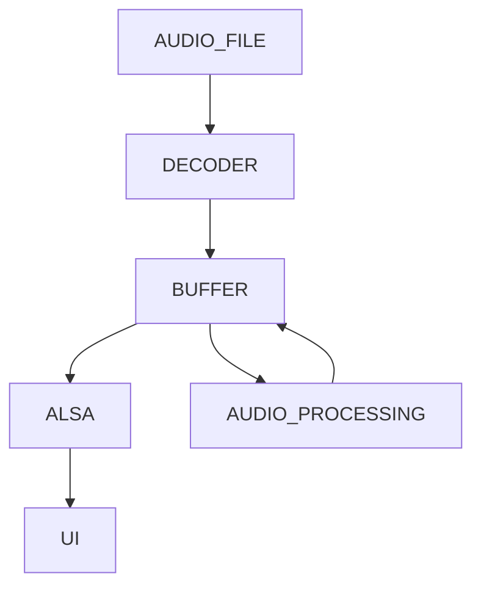

### JULIA_AUDIO

### TODO
1. create decoder (.mp3, .wav file format)
2. add spotify support

### STRUCTURE

audio processing
* audio speed manipulation
* "lofi" option
* pitch shift
* reverb, echo, chorus ...

### REPOS
[player][1]

[1]: https://github.com/julia-audio/player
